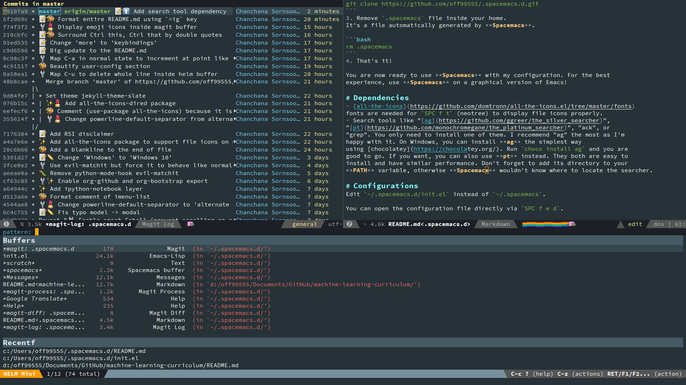
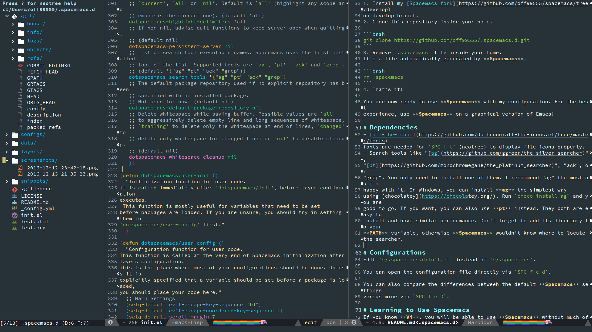

# .spacemacs.d
My `.spacemacs.d` directory for [Spacemacs](https://github.com/syl20bnr/spacemacs)
configurations

# What is [Spacemacs](https://github.com/syl20bnr/spacemacs) ?
**Spacemacs** is an **Emacs** configuration distribution that makes **Emacs**
behave a lot like **Vim** by using modal text editing and also provides many
useful features out of the box.

Its four core pillars are *Mnemonic*, *Discoverable*,
*Consistent* and *"Crowd-Configured"*.

It forces heavy usage of **space** bar, thus the name **Spacemacs**. It refers
to the space bar as `SPC`. The purpose of using space bar is to reduce numbers
of `Ctrl`, `Alt`, `Shift `combinations. It's good for your pinky finger and your
editing speed. It also lowers the risk
of [RSI](https://en.wikipedia.org/wiki/Repetitive_strain_injury).

# Screenshots
These are screenshots taken over time. The most recent one is at the bottom.

My current theme is **material** (I switched back from **majapahit-dark**).

This is a **Spacemacs** instance on Windows 10 with **material** theme showing **which
key** buffer that is invoked by pressing `SPC`.

This is another **Spacemacs** instance on Windows 10 with **majapahit-dark** theme
showing **magit** package and the **Spacemacs** home buffer.

This shows **magit log** and **helm** buffer list. It also shows the
**markdown-mode buffer**.

This shows **nerdtree** on the left with file icons package. It can be toggled
using `SPC f t`

# Installation
1. Install my [Spacemacs fork](https://github.com/off99555/spacemacs/tree/develop)
  on develop branch.

2. Clone this repository into your home.
  `git clone https://github.com/off99555/.spacemacs.d.git`

3. Remove `.spacemacs` file inside your home.
  It's a file automatically generated by **Spacemacs**.
  `rm .spacemacs`

4. That's it!

  You are now ready to use **Spacemacs** with my configuration. For the best
  experience, use **Spacemacs** on a graphical version of Emacs!

# Dependencies
- [all-the-icons](https://github.com/domtronn/all-the-icons.el/tree/master/fonts)
  fonts are needed for `SPC f t` (neotree) to display file icons properly.
- Search tools like "[ag](https://github.com/ggreer/the_silver_searcher)",
  "[pt](https://github.com/monochromegane/the_platinum_searcher)", "ack", or
  "grep". You only need to install one of them. I recommend "ag" the most as I'm
  happy with it. On Windows, you can install **ag** the simplest way
  using [chocolatey](https://chocolatey.org/). Run `choco install ag` and you are
  good to go. If you want, you can also use **pt** instead. They both are easy to
  install and have similar performance. Don't forget to add its directory to your
  **PATH** variable, otherwise **Spacemacs** wouldn't know how to locate the searcher.

# Configurations
Edit `~/.spacemacs.d/init.el` instead of `~/.spacemacs`.

You can open the configuration file directly via `SPC f e d`.

You can also compare the differences betweeh the default **Spacemacs** settings
versus mine via `SPC f e D`.

# Learning to Use Spacemacs
If you know **Vi**, you will be able to use **Spacemacs** without much of a hassle.
But if you don't, you can press `SPC h T` to open the **Evil mode** interactive
tutor so that you can learn enough **Vi** keybindings to survive in **Spacemacs**.

**NOTE:** **Evil mode** is an **Emacs** package that tries to mimic **Vi**.

After you have familiarized yourself with **Evil** modal editing, your next
station is to discover **Spacemacs**' features. You can do so in several ways.

By hitting `SPC ?` you can search for functions that have certain keybindings
attached. You can learn what key does what and what function is assigned to
which key this way.

The biggest help is probably `SPC h SPC`. It lists all **Spacemacs layers** and
packages documentation. The very first document that you should read is named
*BEGINNERS_TUTORIAL.ORG*. Read it first to familiarize yourself with **Spacemacs**.

If things go wrong, you can always press `ESC` or `Ctrl-g` to escape out of
frustration.

## [OPTIONAL] Using Emacs keybindings instead of Vi
If you are an **Emacs** enthusiast, you can switch to use **Emacs** keybindings.
**Emacs** keybindings mode in **Spacemacs** is called a **Holy mode**.
You can toggle between the **Holy mode** and the **Evil mode** by pressing `Ctrl-z`.

But really, who love **Emacs**'s weird keybindings that says *"Ctrl this, Ctrl
that"* all the time anyway?

Everyone loves **Vi** keybindings. ([Unless](http://stackoverflow.com/questions/1218390/what-is-your-most-productive-shortcut-with-vim/1220118#1220118) you do
not [grok](https://en.wikipedia.org/wiki/Grok) **Vi**)
So, try to master **Vi** keybindings and it will be beneficial to you.
If you want to execute the next command in **Holy mode**, you can use `\` key in
**evil normal state** which is similar to **Vi**'s normal mode.

## Cool stuff you can do inside Spacemacs
Before you do any of this stuff, please read the *BEGINNERS_TUTORIAL.ORG* first.
Because the way this section is written is assuming that you understand
**Spacemacs**' core concepts already.

- You can open and view images inside Spacemacs.
- Type `SPC '` to open a shell buffer (specifically **eshell**).
- Type `SPC /` to do a smart search inside the project using the search tool you
  preferred in the *Dependency* section.
- Type `SPC x g t` to translate a word under point using Google translate (the
  language is currently set from English to Thai).
- Type `SPC s w g` to search using Google.
- Type `SPC s s` to search interactively inside current buffer. To edit all the
  matching results, type `C-c C-e` next and do your editing there.
- Type `SPC s e` to activate **iedit** on the current symbol or visually
  selected text. You can then edit this symbol and it will affect all
  occurences inside the buffer.
- Type `SPC g l l` to open current file on **GitHub** in your default web
  browser. (If the file you are on is inside a **git** repository)
- Type `SPC g s` to open a git status of your current file inside **magit**.
  You can discover more actions by typing `?` next.
- Type `SPC f j` or `SPC j d` to jump to a file using **dired-mode**.
- Type `SPC j i` to jump to a function using **helm imenu**
- Type `SPC b i` to to open **imenu list** (a symbol index).
- Type `SPC b s` to open a scratch buffer you can play with immediately.
- Type `SPC f J` to open a new junk file that you can save and abandon later.
- Type `SPC TAB` to toggle between the current buffer and the lastly visited buffer.
- Type `SPC SPC` to execute an **Emacs** command.
- Type `SPC i s` to insert a snippet using **yasnippet**.
- Type `SPC i e` to insert an emoji.
- Type `SPC i l l` to insert a random *lorem ipsum* placeholder text.
- Type `SPC r y` to see all the previously yanked text inside the **kill ring**.
- Type `SPC T F` or `F11` to toggle fullscreen.
- Type `fd` consecutively to quit out of almost everything. You can exit evil
  insert state, evil visual state, helm mode, holy mode, iedit mode, etc.

  If the thing you are trying to quit out of is a **minibuffer**, just press `q`
  to quit it.

## Cool Emacs keys
**Emacs** keybindings can also be nice sometimes. So, instead of hating it. We
should appreciate its good parts and abandon its ugliness.
But most of these keys are also available using `SPC `key too.

- Type `M-q` to toggle between filling or not filling the current paragraph.
  (Wrapping text on to new lines)
- Type `M-t` to transpose current word with the next word.
- Type `M-u` to upper case the next word.
- Type `M-l` to lower case the next word.

