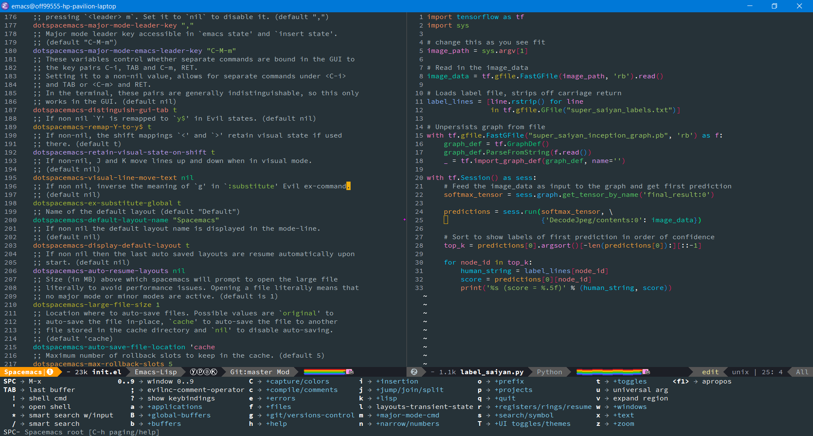
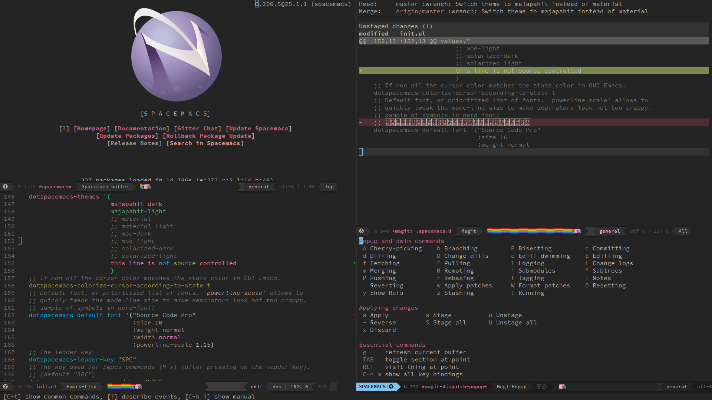

# .spacemacs.d
My `.spacemacs.d` directory for [Spacemacs](https://github.com/syl20bnr/spacemacs)
configurations

# What is [Spacemacs](https://github.com/syl20bnr/spacemacs) ?
**Spacemacs** is an **Emacs** configuration distribution that makes **Emacs**
behave a lot like **Vim** by using modal text editing and also provides many
useful features out of the box.

It forces heavy usage of **space** bar, thus the name **Spacemacs**. It refers
to the space bar as `SPC`. The purpose of using space bar is to reduce numbers of
Ctrl,Alt,Shift combinations. It's good for your health and your editing speed.

# Screenshots
These are screenshots taken over time. The most recent one is at the bottom.

My current theme is **material** (I switched back from **majapahit-dark**).

This is a Spacemacs instance on Windows with **material** theme showing **which
key** buffer that is invoked by pressing `SPC`.
[
](screenshots/2016-12-12_23-42-18.png?raw=true)

This is another Spacemacs instance on Windows with **majapahit-dark** theme
showing **magit** package and the Spacemacs home buffer.
[
](screenshots/2016-12-13_21-35-23.png?raw=true)


# Installation
1. Install my [Spacemacs fork](https://github.com/off99555/spacemacs/tree/develop)
  on develop branch.
2. Clone this repository inside your home.

  ```bash
  git clone https://github.com/off99555/.spacemacs.d.git
  ```
3. Remove `.spacemacs` file inside your home.
  It's a file automatically generated by Spacemacs.

  ```bash
  rm .spacemacs
  ```
4. That's it!

  You are now ready to use Spacemacs with my configuration.

# Configurations
Edit `~/.spacemacs.d/init.el` instead of `~/.spacemacs`.

You can open the configuration file directly via `SPC f e d`.

You can also compare the differences betweeh the default Spacemacs settings
versus mine via `SPC f e D`.

# Learning to Use
If you know Vi, you will be able to use Spacemacs without much of a hassle.
But if you don't, you can press `SPC h T` to open the **Evil mode** interactive
tutor and familiarize yourself with Spacemacs.

**NOTE:** Evil mode is an Emacs package that tries to mimic Vi.

After you have familiarized yourself with **Evil** modal editing, your next
station is to discover Spacemacs' features. You can do so in several ways.

By hitting `SPC ?` you can search for functions that have certain keybindings
attached. You can learn what key does what and what function is assigned to
which key this way.

The biggest help is probably `SPC h SPC`. It lists all **Spacemacs layers** and
the documentation. The very first document that you should read is named
*BEGINNERS_TUTORIAL.ORG*. Start with it first is my suggestion.

If things go wrong, you can always press `ESC` or `Ctrl-g` to escape out of
frustration.
